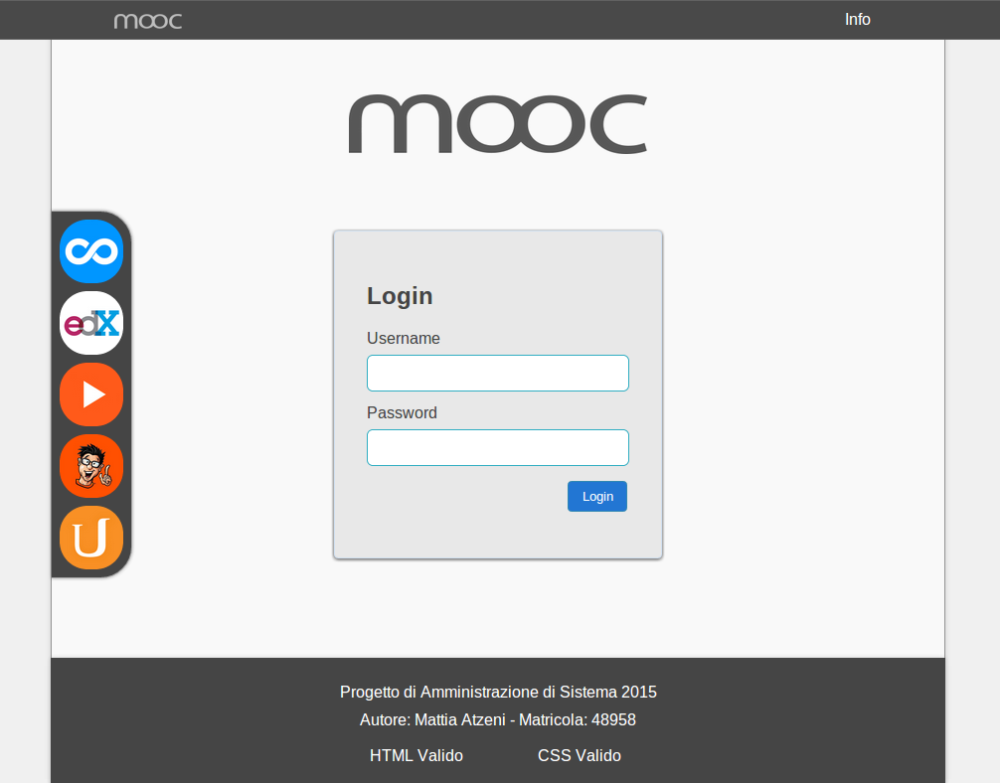
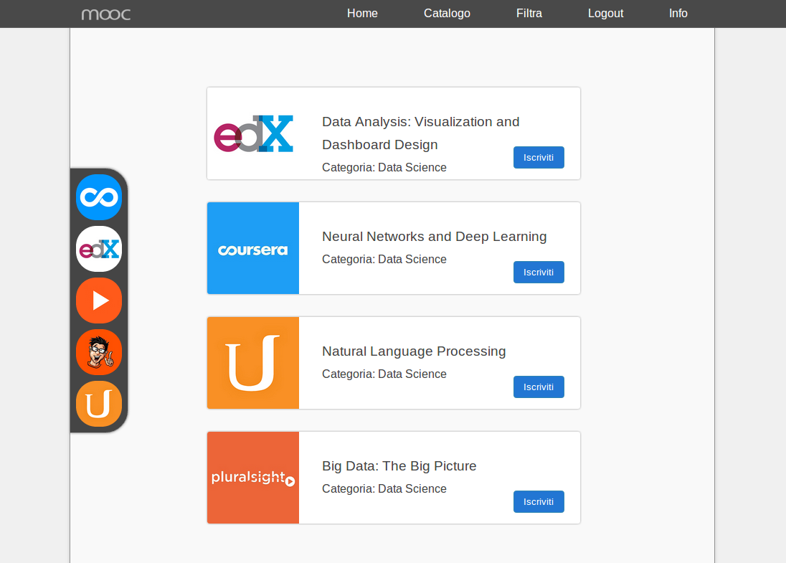

# Mooc: a shared platform for Massive Open Online Courses

Mooc is a platform aimed at providing the user with a unique access point to online courses made available by several different websites, including:

* [Coursera](https://www.coursera.org/)
* [edX](https://www.edx.org/)
* [Udacity](https://eu.udacity.com/)
* [Pluralsight](https://www.pluralsight.com/)

The website is implemented in *php*, using the MVC pattern. The underlying DBMS is MySQL.

Mooc also makes use of JavaScript and jQuery for client-side operations and AJAX functionalities.

## Screenshots

